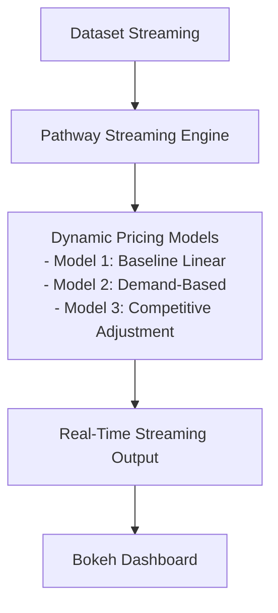

# capstone-project-iitg-

# 🚗 Dynamic Pricing for Urban Parking Lots

## 📚 Project Overview
This project builds a **real-time dynamic pricing system** for urban parking spaces using historical and live parking data.  
We develop **three pricing models** of increasing complexity to optimize parking utilization based on demand, congestion, and competitor pricing.

Real-time simulation is achieved using **Pathway’s streaming engine**, and the pricing results are visualized through **Bokeh dashboards.**

---

## 🚀 Tech Stack Used
- Python 3.10+
- Pandas - Data manipulation
- NumPy - Numerical operations
- Bokeh - Real-time visualization
- Pathway - Real-time streaming and simulation
- Google Colab - Model development environment
- Mermaid - Architecture diagram (GitHub compatible)

---

## 🏗️ Project Architecture

Workflow and Architecture Explained in Simple Terms

Step 1: Real-Time Data Streaming with Pathway**

We start by feeding the parking lot dataset into the system as if it's being received live in real-time.
To make this happen, we use **Pathway’s streaming engine** which helps us process the incoming data step-by-step in **small batches**.
This ensures the system can **simulate real-time updates** while keeping the time sequence correct.

Step 2: Real-Time Pricing Calculation**

As the live data flows in, the system instantly calculates the updated parking prices using **three different pricing models:

* Model 1 (Simple Linear Model):
  This model increases the price slowly as the parking lot fills up. It only looks at how full the parking lot is.

* Model 2 (Demand-Based Pricing):
  This model uses more factors to calculate the price. It looks at:

  * How full the parking lot is (occupancy)
  * How many vehicles are waiting to enter (queue length)
  * The nearby traffic condition (low, medium, high)
  * Whether it’s a special day (like an event or holiday)
  * What type of vehicle is entering (cars, bikes, or trucks)

* Model 3 (Competitive Pricing):
  This model checks if nearby parking lots are cheaper or more expensive.
  If competitors are cheaper, this model slightly lowers the price to stay attractive.
  If competitors are more expensive, it raises the price a little to maximize profit.

Step 3: Streaming the Output

After the system calculates the new prices, it **writes them to a CSV file continuously.**
This file acts as a **live feed** that the dashboard will monitor and display.

Step 4: Real-Time Visualization

We use a **Bokeh dashboard** that keeps an eye on the live CSV file.
It refreshes automatically to show the most recent prices for each parking lot.

The dashboard helps users to:

* Watch the parking prices changing live.
* Compare how each of the three models is behaving side-by-side.

Summary:

* The system continuously takes live data, calculates new prices, streams the results, and instantly visualizes them.
* It gives users **real-time insights** into how parking prices change throughout the day under different conditions.

Code:

!pip install pathway bokeh --quiet

import pandas as pd
import numpy as np
import time
from bokeh.plotting import figure, show, output_notebook
from bokeh.models import ColumnDataSource
from bokeh.io import push_notebook
from IPython.display import display, clear_output

from google.colab import files
uploaded = files.upload()

df = pd.read_csv('dataset.csv')
df['Timestamp'] = pd.to_datetime(df['LastUpdatedDate'] + ' ' + df['LastUpdatedTime'], format='%d-%m-%Y %H:%M:%S')
df.sort_values('Timestamp', inplace=True)

vehicle_weight = {'car': 1.0, 'bike': 0.5, 'truck': 1.5}
traffic_weight = {'low': 1, 'medium': 2, 'high': 3}

df['VehicleTypeWeight'] = df['VehicleType'].map(vehicle_weight)
df['TrafficLevel'] = df['TrafficConditionNearby'].map(traffic_weight)

base_price = 10

alpha_1 = 0.5
df['Price_Model1'] = base_price

for lot_id in df['SystemCodeNumber'].unique():
    lot_data = df[df['SystemCodeNumber'] == lot_id].sort_values('Timestamp')
    prices = [base_price]

    for i in range(1, len(lot_data)):
        previous_price = prices[-1]
        occupancy = lot_data.iloc[i - 1]['Occupancy']
        capacity = lot_data.iloc[i - 1]['Capacity']
        new_price = previous_price + alpha_1 * (occupancy / capacity)
        new_price = max(new_price, 0)
        prices.append(new_price)

    df.loc[df['SystemCodeNumber'] == lot_id, 'Price_Model1'] = prices

lambda_factor = 0.5
alpha = 0.4
beta = 0.2
gamma = 0.3
delta = 0.5
epsilon = 0.2

df['Price_Model2'] = base_price

for lot_id in df['SystemCodeNumber'].unique():
    lot_data = df[df['SystemCodeNumber'] == lot_id].sort_values('Timestamp')
    prices = []

    for i in range(len(lot_data)):
        row = lot_data.iloc[i]
        demand = (alpha * (row['Occupancy'] / row['Capacity'])
                  + beta * row['QueueLength']
                  - gamma * row['TrafficLevel']
                  + delta * row['IsSpecialDay']
                  + epsilon * row['VehicleTypeWeight'])

        normalized_demand = max(demand, 0) / (1 + max(demand, 0))
        price = base_price * (1 + lambda_factor * normalized_demand)
        price = max(min(price, 2 * base_price), 0.5 * base_price)
        prices.append(price)

    df.loc[df['SystemCodeNumber'] == lot_id, 'Price_Model2'] = prices

df['Price_Model3'] = df['Price_Model2']

for lot_id in df['SystemCodeNumber'].unique():
    lot_data = df[df['SystemCodeNumber'] == lot_id].sort_values('Timestamp')
    prices = []

    for i in range(len(lot_data)):
        row = lot_data.iloc[i]
        price_2 = row['Price_Model2']

        if price_2 < base_price:
            price_3 = price_2 * 0.95
        else:
            price_3 = price_2 + 0.5

        price_3 = max(min(price_3, 2 * base_price), 0.5 * base_price)
        prices.append(price_3)

    df.loc[df['SystemCodeNumber'] == lot_id, 'Price_Model3'] = prices

output_notebook()

lot_id = df['SystemCodeNumber'].unique()[0]
lot_data = df[df['SystemCodeNumber'] == lot_id]

source = ColumnDataSource(data=dict(time=[], model1=[], model2=[], model3=[]))

p = figure(title=f"Real-Time Pricing Simulation for Lot {lot_id}", x_axis_type='datetime', width=900, height=400)
p.line('time', 'model1', source=source, color='blue', legend_label='Model 1')
p.line('time', 'model2', source=source, color='green', legend_label='Model 2')
p.line('time', 'model3', source=source, color='red', legend_label='Model 3')
p.legend.location = 'top_left'
p.xaxis.axis_label = 'Time'
p.yaxis.axis_label = 'Price ($)'

handle = show(p, notebook_handle=True)

previous_price = base_price

for i in range(len(lot_data)):
    row = lot_data.iloc[i]

    new_data = dict(time=[row['Timestamp']],
                    model1=[row['Price_Model1']],
                    model2=[row['Price_Model2']],
                    model3=[row['Price_Model3']])

    source.stream(new_data, rollover=100)
    push_notebook(handle=handle)

    time.sleep(0.5)

